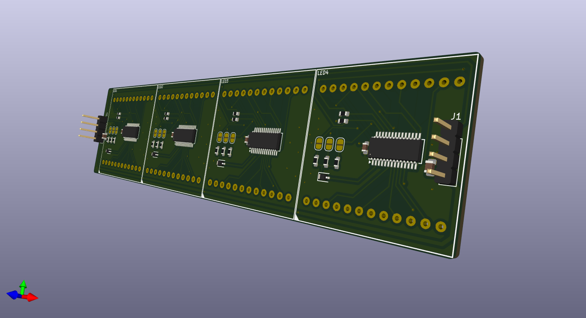
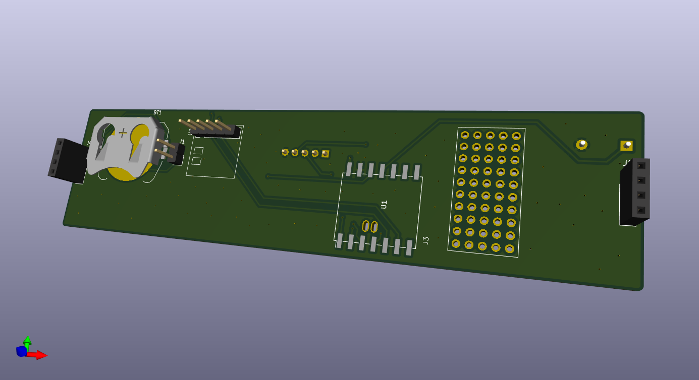
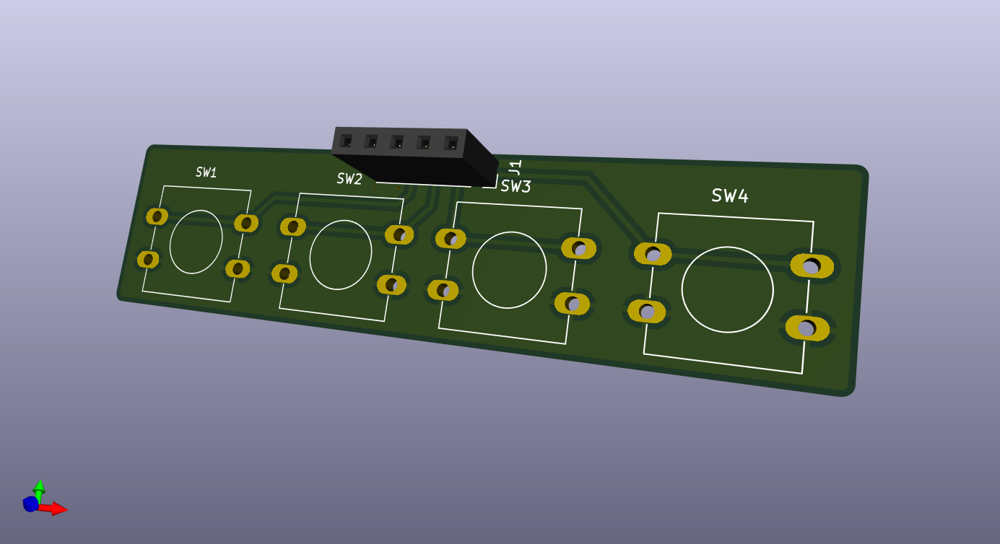

# bicolor-matrix

Inspired by the common 32x8 red LED matrix modules that use the MAX7219 IC (and similar clones), I wanted to make my own module, but unlock more colours. Although red LEDs are pretty cool, I wanted more options but without having to change the modules, perhaps just by clicking a button...

(there are also modules/boards with WS2812 RGB LEDs matricies which are practically much better but you need to create a DIY solution for diffusing them)

I found [these](https://www.aliexpress.com/item/1005007029570407.html) modules on Aliexpress and bought the red and light green variant, so I can have red, a light green, and a nice orange all in one module. I found [this](https://www.adafruit.com/product/902) Adafruit matrix and used a similar schematic but with a completely different board layout and with 4 modules on one PCB.

Matrix Board:

Adapter Board:
This adds functionality through a SeeedStudio XIAO ESP32C3 board, a DS3231 module and a small buzzer, with a mini breadboard style layout to accomadate further additions

Button Board:
Adapts to the adapter board and provides 4 interface buttons for setting the time, alarm, and screen colour(the pin socket will be on the back side).

## Adapter Board Bill of Materials (BOM)

| Item             | Description                       | Quantity  |
| ---------------- | --------------------------------- | --------- |
| Microcontroller  | SeeedStudio XIAO ESP32C3          | 1         
| Buzzer           | Passive Piezzo Buzzer             | 1         |

I own the rest of the components needed, just these parts are needed from Grounded.