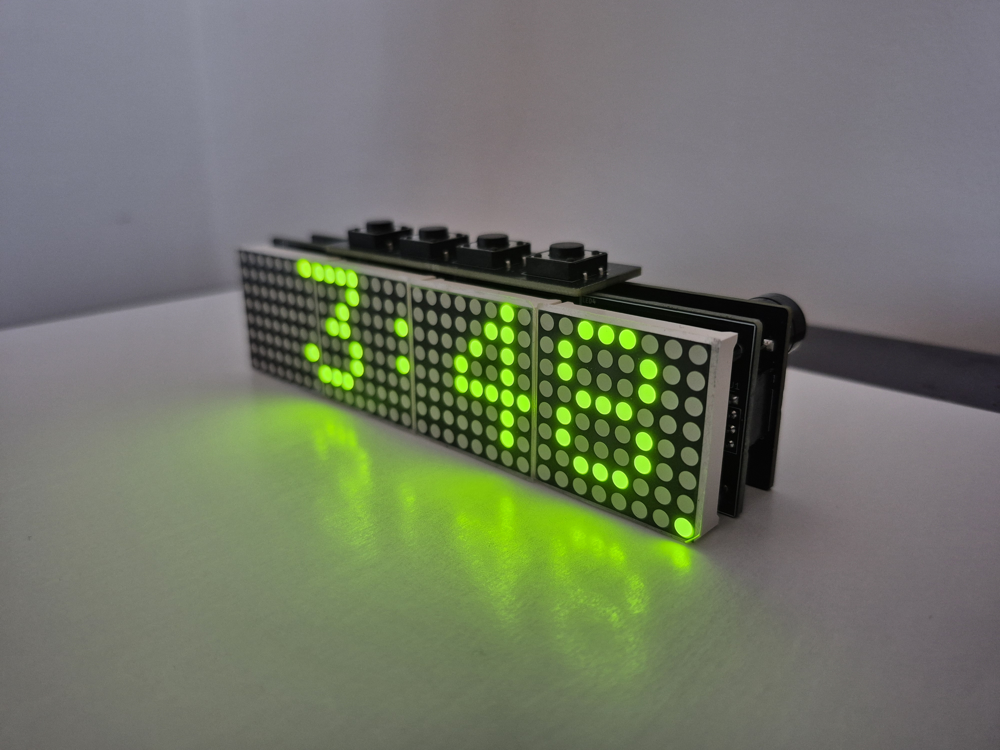
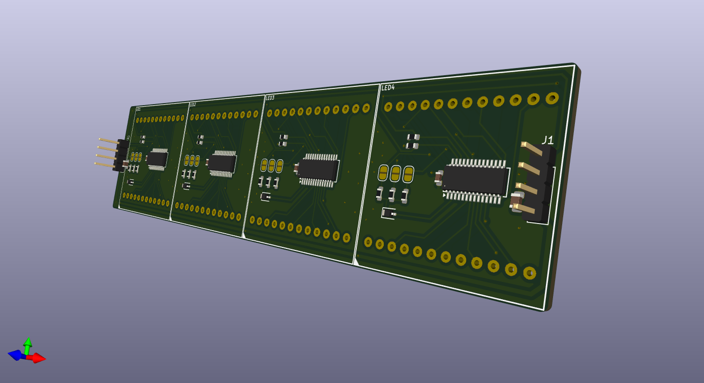
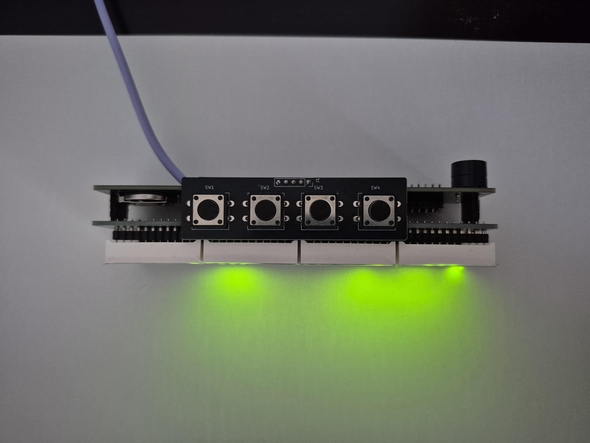
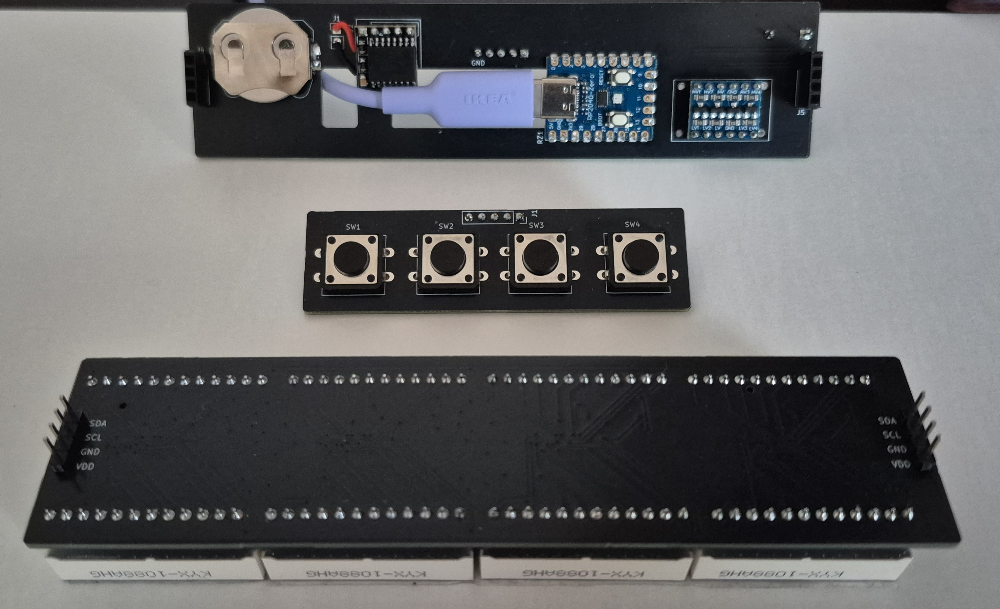
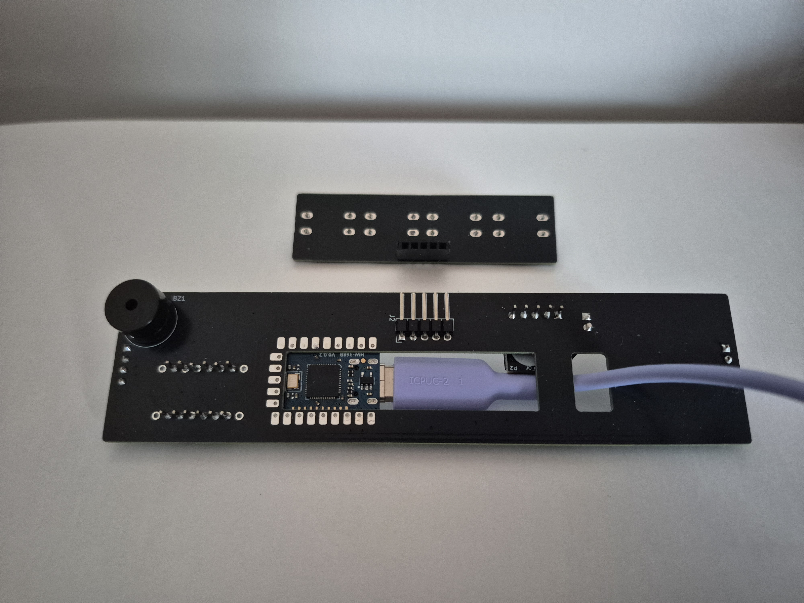
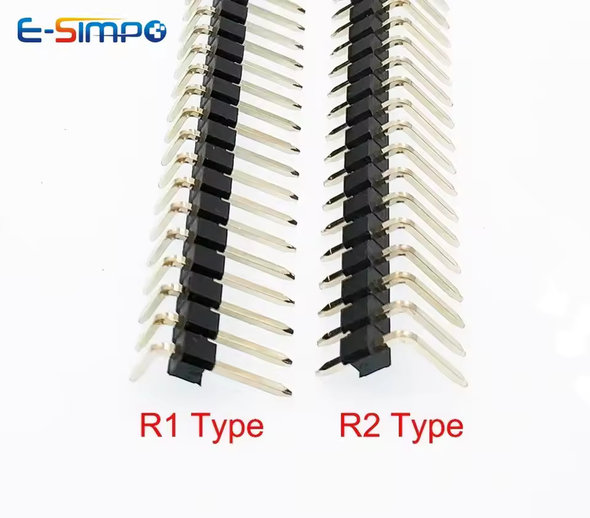

# bicolor-matrix

A 32x8 bicolor LED matrix module composed of 4 8x8 matrices based on the Holtek HT16K33A I2C LED driver.

## Inspiration

Inspired by the common 32x8 red LED matrix modules that use the MAX7219 IC, I wanted to make my own module but with more colours and functionality, while keeping the same asthetic. 

I found [these](https://www.aliexpress.com/item/1005007029570407.html) modules while browsing Aliexpress and thought they could look be a cool alternative. With the red and light green variant, you can have red, a light green, and orange all in one module. As far as I'm aware, there aren't RGB modules in a similar form factor, although you can take generic WS2818 8x8 matricies and 3D print a diffuser for them, although the footprint is much bigger. This project was also partially inspired by [bitluni's LED magnet tiles](https://www.youtube.com/watch?v=L2J_eNgjxio) which I found really cool.

Unlike the single colour matricies with 16 pins, these had 24. I found [this](https://www.adafruit.com/product/902) Adafruit module and followed a similar schematic with the Holtek HT16K33A I2C LED driver, but with an inverted board layout, and with 4 modules on one PCB. This was my 2nd PCB project, so it was definately a big undertaking.

## Showcase

Matrix Board:

Adapter Board:
This adds functionality through a RP2040 Zero board, a DS3231 module and a small buzzer, and a generic logic level shifter since the Holtek IC only operates near 5V.

Button Board:
An addition to the adapter board and provides 4 interface buttons for setting time

## Bill of Materials (BOM) + Assembly Notes
Item | Quantity | Description
| -------- | ------- | ------- |
[Machine Pin Headers](https://www.aliexpress.com/item/10000000838267.html) | 5 Pcs | 2.54mm pitch circular pin headers to connect the LED matricies to the main PCB. These are needed such as to not solder the matrix boards directly to the PCB, allowing for easier replacement if needed.
12mm x 12mm Buttons | 4 | Generic 12mm tactile push buttons, whatever is cheapest on Aliexpress. I used [these](https://www.aliexpress.com/item/10000000838267.html).
RP2040 Zero | 1 | Microcontroller board, whatever is cheapest on Aliexpress. I bought from [here](https://www.aliexpress.com/item/1005007650325892.html).
[DS3231 Module](https://www.aliexpress.com/item/1005007143842437.html) | 1 | Mini module without the battery, basically a simple breakout. Use side cutters to cut the plastic on the pre-soldered female headers, then desolder each of the pins. Solder in male headers.
Level Shifter | 1 | 4-channel logic level shifter module, whatever is cheapest on Aliexpress. They are cheapest in packs of 10, so you can use the extra ones for other projects. I bought from [here](https://www.aliexpress.com/item/1005006765742290.html).
Buzzer | 1 | Generic 3.3V 7.6mm diameter buzzer, whatever is cheapest on Aliexpress.
[Right Angle Pin Headers](https://www.aliexpress.com/item/32896209964.html) | 1 | Get the R1 type of pin headers pictured here, they're slightly more uncommon and more expensive than the R1 type. This is for the button board connection. 
2.54mm Pin Headers (Male and Female) | 1 | To connect the matrix board to the adapter board and general use. This [video](https://www.youtube.com/watch?v=qDG3VFSMSPQ) shows how to make custom length female headers.

Buying Note: I recommend you try to buy components on the Aliexpress mobile app (web on desktop doesn't seem to have a search bar) in Bundle Deals if you can find them as you can get better prices, and they usually ship faster.

Ordering Note: I recommend you to create your own adapter board for the project. The one I built has some design flaws (button board doesn't fit flush with the adapter board, the right angle headers need to be positioned lower, and usb connector placement could be improved).

It was designed to be a prototype and optimize costs, so I recommend you to make your own design based on your needs. I was browsing Aliexpress a few days ago and found this [RP2350 stamp module](https://www.aliexpress.com/item/1005008513193739.html) which would make a better alternative since you can position the USB connector anywhere on the PCB. It's also relatively cheap.