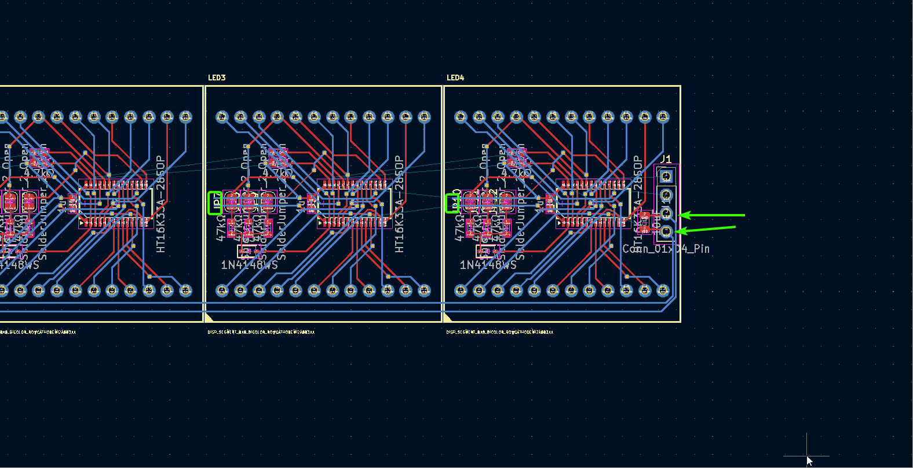
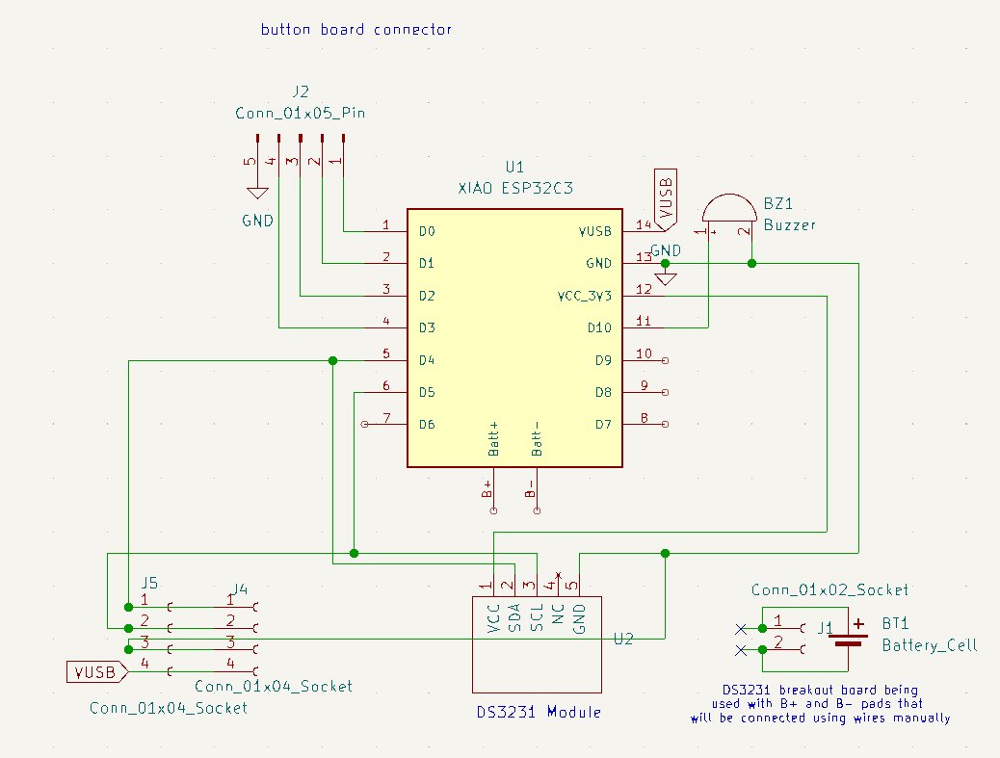
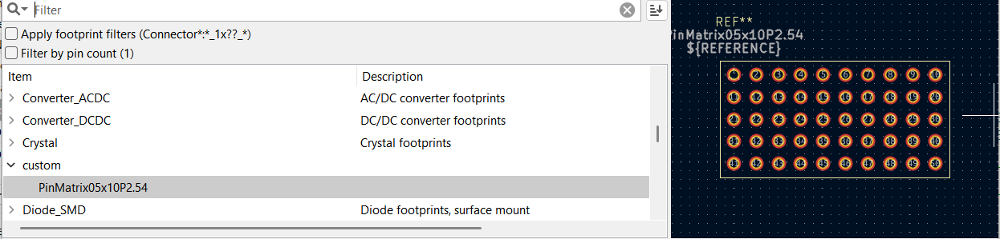
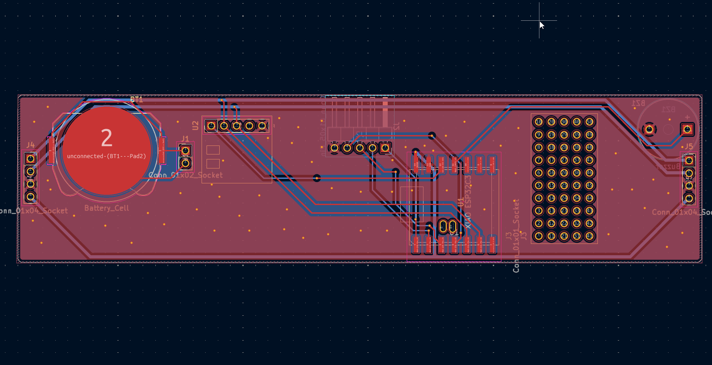
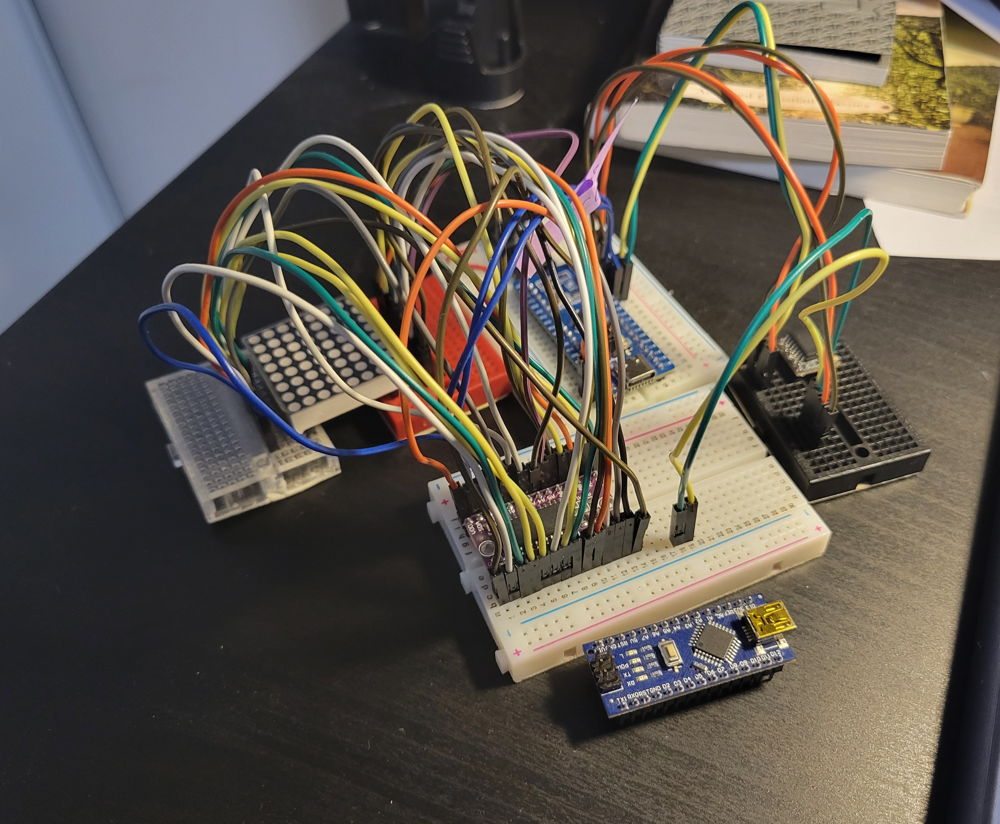
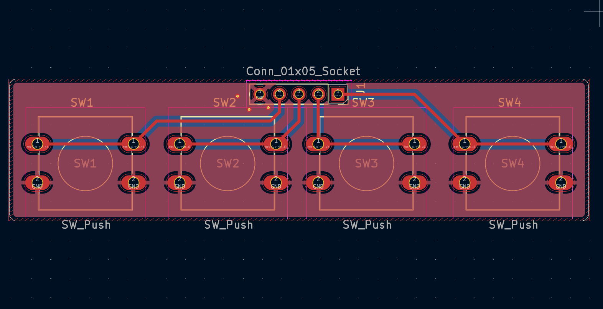

## 2025-05-19
Four years ago, I built a custom clock with off-the-shelf parts (Arduino Nano, DS3231 breakout, 32x8 MAX7219 LED Matrix, all on a breadboard with 2 buttons). Although it has worked very reliably, only needing a few battery replacements and resetting the nano a few times, I want to make a custom solution.

*the current solution ✨*

### Plans
Displays: https://www.aliexpress.com/item/1005007029570407.html
bicolour 8x8 led matrix !! (Red Yellow Green CC)
 \
Controller: Holtek HT16K33A
https://www.holtek.com/webapi/116711/HT16K33Av102.pdf
likely going to take inspiration from here: 
- https://www.adafruit.com/product/902
- https://learn.adafruit.com/adafruit-led-backpack/bi-color-8x8-matrix

Display Schematic (from Adafruit):

Using these connections (no STEMMA connectors, just 4 ICs wired on a PCB to same I2C bus with different addresses hard-set on each IC), I will probably make a similar PCB layout with these segments + a microcontroller (possibly a SMD rp2040-zero) with a RTC module and battery slot + controlls for time adjustment and screen brightness controll + an alarm feature. \
I could also use an ESP32 XIAO board and make a feature to add alarms with your phone (maybe also experiment with Zigbee?). I shall see. \
All rough ideas for now, I have some parts in mind but I will likely have to order the screens and a HT16K33(A) breakout board (https://www.aliexpress.com/item/1005006831500717.html) to see if this idea is feasible. If it is, this will be pretty epic.

hours spent: 4

## 2025-05-22
Ordered the 10 pack of LED matricies and the HT16K33 breakout board. I'll prototype with it and build a schematic based on that. The cost of the other components will likely not be much. Not much else for today.

hours spent: n/a

## 2025-05-26
I found this video a few days ago that popped into my YT rec: https://www.youtube.com/watch?v=7fNYj0EXxMs. The PCB design was shown for a few seconds and its quite interesting since he uses the same Holtek driver (along with an I2C address translator; LTC4316) to drive a row of 8 displays, each with 20 pins: 

I'll try and see what magic was performed here (since idk much about this) and see if I can emulate it !!
update: I decided to just go with 4 ICs chained together this is probably beyond my scope

hours spent: n/a

## 2025-05-30
The shipment of the LED matricies and breakout board arrived!! I will assemble them soon (according to the Adafruit schematic) with an arduino nano probably to test. One thing I noticied is that the breakout is kinda sketchy in quality (ive never seen such a thin pcb). Anwyays, it should be fine.

hours spent: n/a

## 2025-06-03
Finally got time to wire everything together. Took me roughly 2hrs to make all the breadboard connections according to the schematic. But it works!\

I tested using the Adafruit example sketch. There are some buggy sections which I'll have to look into later, but for now it looks promising. I guess it's PCB design time. My updates might be less frequent since I'll be busy with a bunch of things.

hours spent: 2.5

## 2025-06-12
Its been a while (got busy) but finally got around to making the schematic (I made one copy and then copy pasted it 4 times; it should work for now). It took be a bit to import the LED controller IC symbol from easyeda (setting up easyeda2kicad and downloading plugins and stuff). The routing is kinda messy but we ball. Took me roughly 2-3hrs I lost track. 

I downloaded and imported the Adafruit board into KiCad so I can reference it while making mine, but my design will be pretty different since they mounted the display on the back of the PCB (mine will be in the front so the pins are mirrored/flipped)

hours spent: 3

## 2025-07-10
OKAY SO life happened. Starting the PCB was quite intimidating so I kind of clicked switch to PCB and left the project for a month. BUT I have convinced myself to get started. And yes it is a lot harder than I thought routing this is pretty pain since I've only done HC solder before. Will prob have to use a lot of vias. Not dealing with any important signals so I should be fine for the most part. \
Slight time skip but no picture for now since I had to delete all my traces a few times. Will be slaving away at this tomorrow.

hours spent: 3

## 2025-07-11
Some progress. Was pain, idk what I'm doing. Not much to say. Took me roughly an hour or 2. 

hours spent: 2

## 2025-07-13
OKAY SO AFTER GOING THROUGH ALL THAT... I was using the SOP28 footprint for the LED driver when I meant to use SSOP28. Welp.. time to restart the routing again. Actually I'll do this tomorrow I'm tired.

hours spent: 1

## 2025-07-14
Honestly after this much practice, this is becoming not as hard anymore !! \
managed to get some decent progress:

took about 2hrs

hours spent: 2

## 2025-07-15
Finally pretty much done one module, but now I've realized that I can't really copy-paste the design over. I gotta use layout replication (https://www.youtube.com/watch?v=DBfI2wwno5o) and using a custom goofy schematic size wasn't the best idea. I thought I could get away with the jank 😔. I will do that soon. I will also upload the PCB to this repo soon but I'm editing this on WSL and my project folder is on Windows so I got a bit lazy in doing that until now.

hours spent: 2

## 2025-08-10
I just restarting working on it :pf:. Yet again got busy. Anyways, finally setup the replicate layout plugin (the guide was useful) and managed to 4x the layout properly. It took quite a while. I have yet to put the routing for connecting them all together, (and I still have no clue what I'm doing) but overall good progress today.

hours spent: 2

## 2025-08-12
Got some feedback from a friend and adjusted my routing a bit, and also synced it with the other 4 modules. I tried to route the power/gnd/i2c lines but my routing seems very sketchy. I'll try to improve on it tomorrow. Not much else to say.

hours spent: 1

## 2025-08-13
I got some feedback from the Slack and added stitching vias to my ground plane (I did not know these were a thing). I also improved my layout further in terms of connecting it all together and adding polish (rounded corners, silkscreen, fixing small DRC warnings, etc.).

hours spent: 1.5

## 2025-08-15
Got some more feedback and everything seems to be good. I will verify the connections in the schematic a last time before I mark this part of the project as done. I also created the project and for now the schematic for the adapter/driver board to make a simple but smart clock. I'll add my sketches later but the 2 boards will probably be the same size with standard headers and I can right angle mount a top board with 2 headers using some right angle header pins I have. I just have to make sure the measurements are right.

hours spent: 1

## 2025-08-19
Just started to work on the adapter board. The schematic was quite easy to make but had to make a real quick custom symbol for the DS3231 module I already had. It's slightly scuffed but not too bad. I'm thinking of using an ESP32 as clicking a bunch of buttons to set an alarm seems cumbersome especially since I usually don't have a static alarm time. It feels like something easier set on your phone. I don't have much more time today so I will start the PCB tomorrow.

hours spent: 1

## 2025-08-19

I thought of adding a small breadboard-style layout to the PCB if i wanted to tack on some components in the future with some wires. Made a quick custom footprint for that (and random symbol since it doesn't really matter).

I started work on the PCB and I've gotten decent progress. I want to power the thing through the USB on the ESP32, so I am trying to add clearance for that. The range doesn't have to be amazing since I very likely won't be setting my alarm from another room. This is more of a personally tailored PCB rather than something that suits everyone.

hours spent: 2

# 2025-08-21

I originally only allocated space for 2 buttons, but later changed it to 4, since I'll probably need more for the function I want. I don't like the idea of having the time to be dependent on the internet, so I'd like the option to set time time up up/down controls, a button to switch the display colours and a button to toggle/snooze the alarm. I am mostly done the PCB I believe.

I realized my prototype I made a whie ago wasn't really working properly so I got a bit worried and decided to rewire the entire thing according to the schematic. Turns out I misread a pin due to the bad silkscreen on the breakout board I got... so now it actually works. At least now I have confirmation my schematic works. I also wired up the RTC module and used claude to make a quick test program; everything works fine!! (extra stuff in picture is from other projects/random leftovers)

hours spent: 3.5

# 2025-08-22

Last stretch is the button board, which was very easy to make, just a basic schematic. I measured how long the pinheader would be with my callipers (gap between the adapter and matrix PCB) and its around 18mm, so I made the board roughly that long. Slap in a gound plane and pin socket and simple routing and its done. I should finally be done... yippee !!

hours spent: 1

