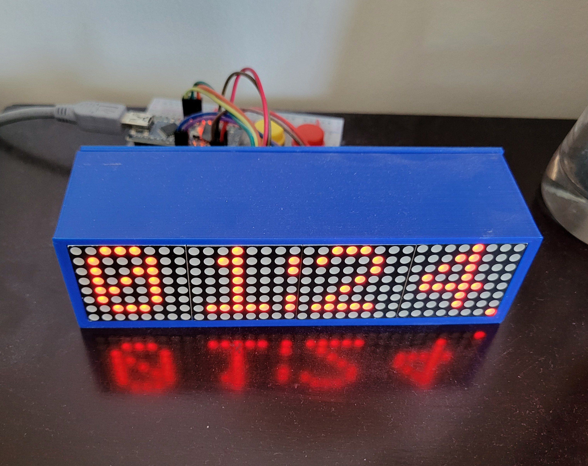
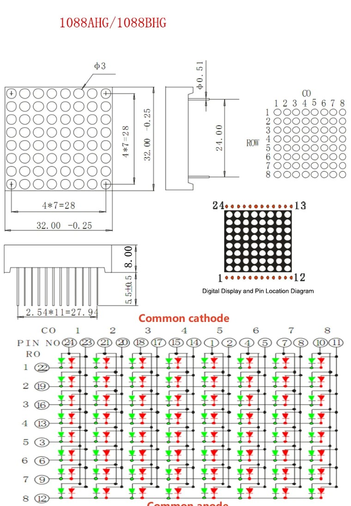
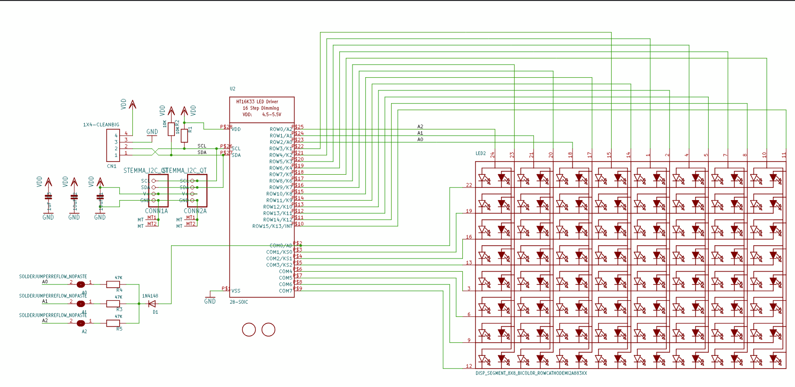
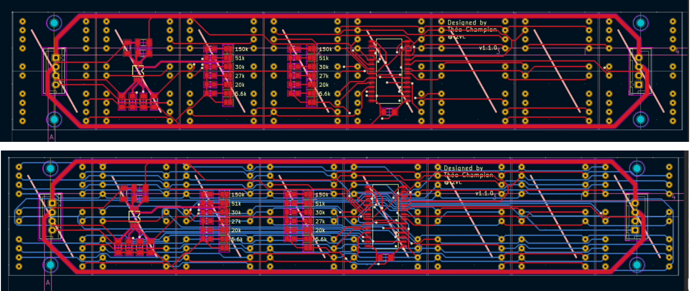
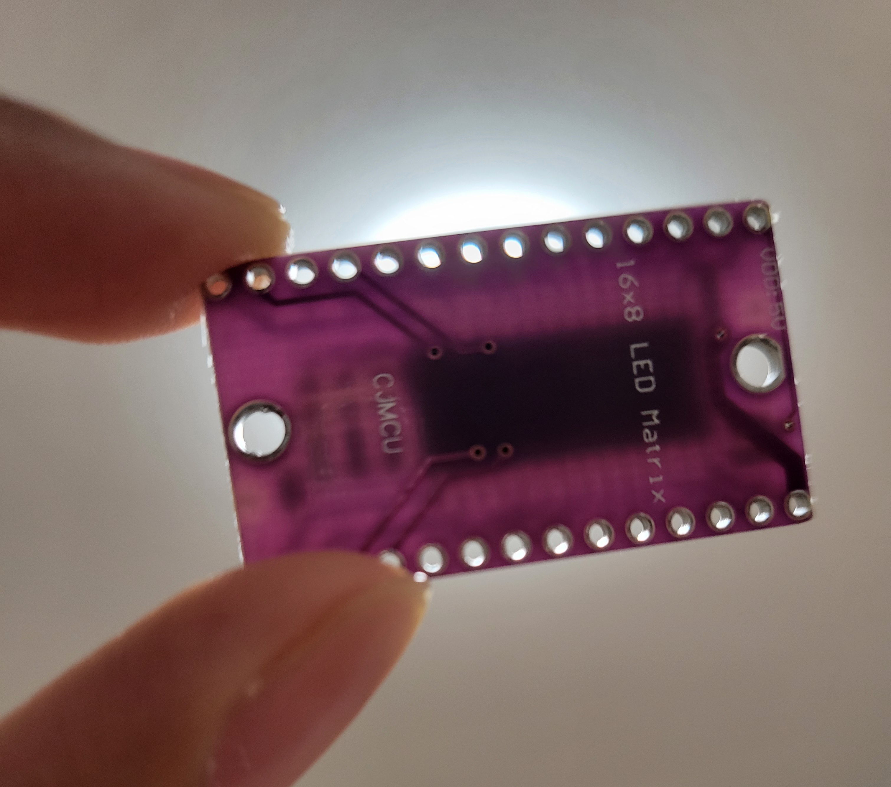
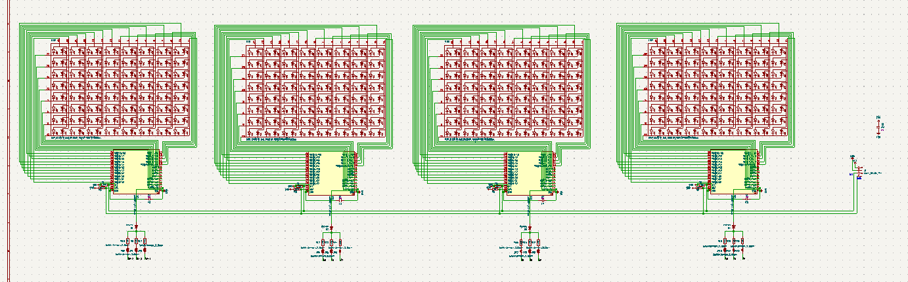
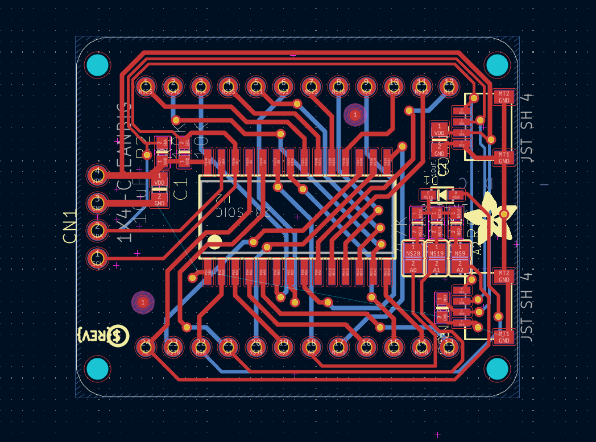
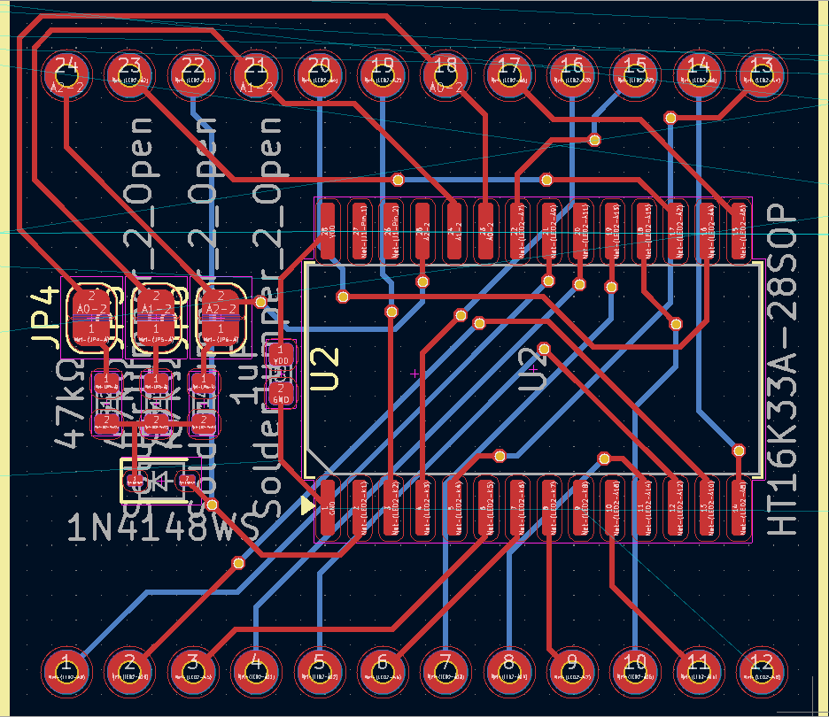
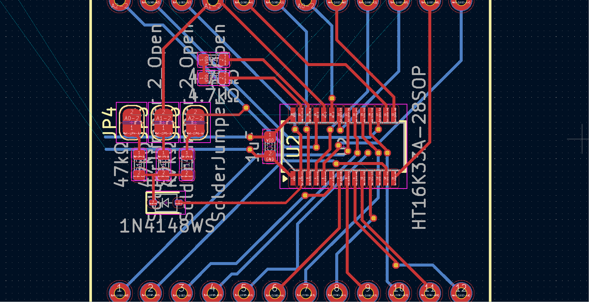
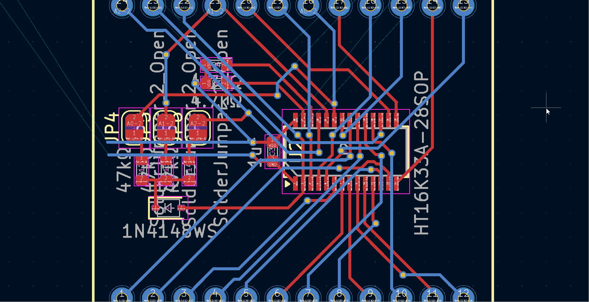

## 2025-05-19
Four years ago, I built a custom clock with off-the-shelf parts (Arduino Nano, DS3231 breakout, 32x8 MAX7219 LED Matrix, all on a breadboard with 2 buttons). Although it has worked very reliably, only needing a few battery replacements and resetting the nano a few times, I want to make a custom solution.

*the current solution ✨*

### Plans
Displays: https://www.aliexpress.com/item/1005007029570407.html
bicolour 8x8 led matrix !! (Red Yellow Green CC)
 \
Controller: Holtek HT16K33A
https://www.holtek.com/webapi/116711/HT16K33Av102.pdf
likely going to take inspiration from here: 
- https://www.adafruit.com/product/902
- https://learn.adafruit.com/adafruit-led-backpack/bi-color-8x8-matrix

Display Schematic (from Adafruit):

Using these connections (no STEMMA connectors, just 4 ICs wired on a PCB to same I2C bus with different addresses hard-set on each IC), I will probably make a similar PCB layout with these segments + a microcontroller (possibly a SMD rp2040-zero) with a RTC module and battery slot + controlls for time adjustment and screen brightness controll + an alarm feature. \
I could also use an ESP32 XIAO board and make a feature to add alarms with your phone (maybe also experiment with Zigbee?). I shall see. \
All rough ideas for now, I have some parts in mind but I will likely have to order the screens and a HT16K33(A) breakout board (https://www.aliexpress.com/item/1005006831500717.html) to see if this idea is feasible. If it is, this will be pretty epic.

## 2025-05-22
Ordered the 10 pack of LED matricies and the HT16K33 breakout board. I'll prototype with it and build a schematic based on that. The cost of the other components will likely not be much. Not much else for today.

## 2025-05-26
I found this video a few days ago that popped into my YT rec: https://www.youtube.com/watch?v=7fNYj0EXxMs. The PCB design was shown for a few seconds and its quite interesting since he uses the same Holtek driver (along with an I2C address translator; LTC4316) to drive a row of 8 displays, each with 20 pins: 

I'll try and see what magic was performed here (since idk much about this) and see if I can emulate it !!
update: I decided to just go with 4 ICs chained together this is probably beyond my scope

## 2025-05-30
The shipment of the LED matricies and breakout board arrived!! I will assemble them soon (according to the Adafruit schematic) with an arduino nano probably to test. One thing I noticied is that the breakout is kinda sketchy in quality (ive never seen such a thin pcb). Anwyays, it should be fine.

## 2025-06-03
Finally got time to wire everything together. Took me roughly 2hrs to make all the breadboard connections according to the schematic. But it works!\

I tested using the Adafruit example sketch. There are some buggy sections which I'll have to look into later, but for now it looks promising. I guess it's PCB design time. My updates might be less frequent since I'll be busy with a bunch of things.

## 2025-06-12
Its been a while (got busy) but finally got around to making the schematic (I made one copy and then copy pasted it 4 times; it should work for now). It took be a bit to import the LED controller IC symbol from easyeda (setting up easyeda2kicad and downloading plugins and stuff). The routing is kinda messy but we ball. Took me roughly 2-3hrs I lost track. 

I downloaded and imported the Adafruit board into KiCad so I can reference it while making mine, but my design will be pretty different since they mounted the display on the back of the PCB (mine will be in the front so the pins are mirrored/flipped)

## 2025-07-10
OKAY SO life happened. Starting the PCB was quite intimidating so I kind of clicked switch to PCB and left the project for a month. BUT I have convinced myself to get started. And yes it is a lot harder than I thought routing this is pretty pain since I've only done HC solder before. Will prob have to use a lot of vias. Not dealing with any important signals so I should be fine for the most part. \
Slight time skip but no picture for now since I had to delete all my traces a few times. Will be slaving away at this tomorrow.

## 2025-07-11
Some progress. Was pain, idk what I'm doing. Not much to say. Took me roughly an hour or 2. 

## 2025-07-13
OKAY SO AFTER GOING THROUGH ALL THAT... I was using the SOP28 footprint for the LED driver when I meant to use SSOP28. Welp.. time to restart the routing again. Actually I'll do this tomorrow I'm tired.

## 2025-07-14
Honestly after this much practice, this is becoming not as hard anymore !! \
managed to get some decent progress:

took about 2hrs

## 2025-07-15
Finally pretty much done one module, but now I've realized that I can't really copy-paste the design over. I gotta use layout replication (https://www.youtube.com/watch?v=DBfI2wwno5o) and using a custom goofy schematic size wasn't the best idea. I thought I could get away with the jank 😔. I will do that soon. I will also upload the PCB to this repo soon but I'm editing this on WSL and my project folder is on Windows so I got a bit lazy in doing that until now.

